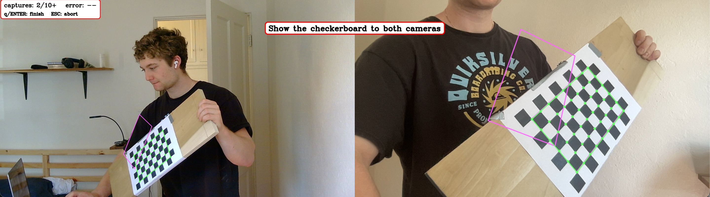
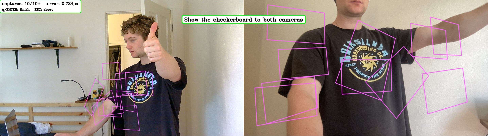
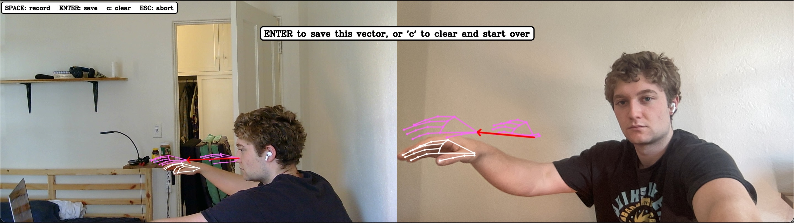
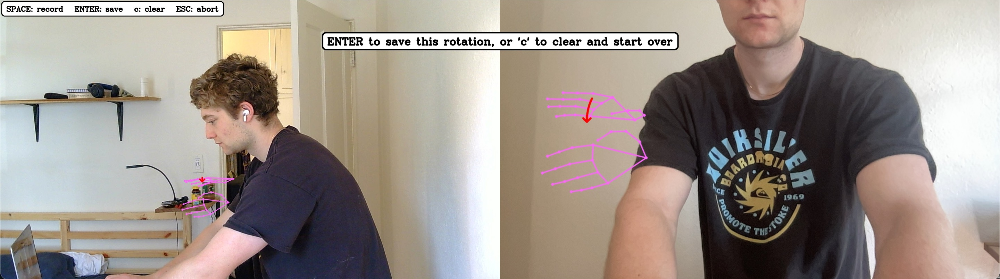
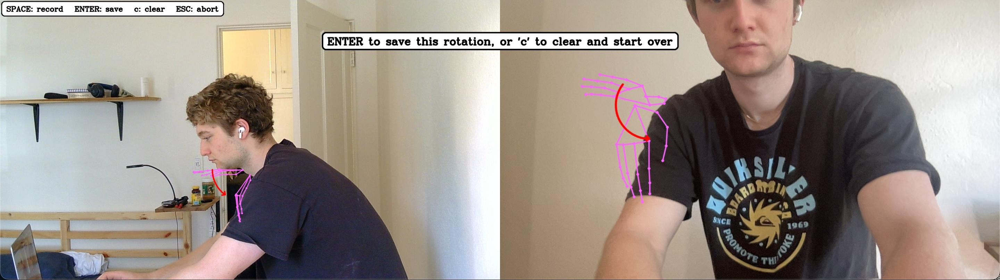

# SO-101 Human Teleop

Control an [SO-101](https://github.com/TheRobotStudio/SO-ARM100) with your own hand: Two cameras triangulate your wrist's real 3D position and your hand's orientation; that drives the arm's reach, wrist roll, wrist pitch, yaw, and gripper in real time.

<video src="https://raw.githubusercontent.com/henrynitzberg/SO101_Human_Teleop/main/docs/media/human-teleop.mp4" controls muted></video>

## Contents

- [Overview](#overview)
- [How It Works](#how-it-works)
- [Repository Layout](#repository-layout)
- [Prerequisites](#prerequisites)
- [1. Environment Setup](#1-environment-setup)
- [2. Sanity-Check the Robot Connection](#2-sanity-check-the-robot-connection)
- [3. Camera Placement](#3-camera-placement)
- [4. Calibration](#4-calibration)
- [5. Recording Robot Poses](#5-recording-robot-poses)
- [6. Running Teleop](#6-running-teleop)
- [7. Tuning Reference](#7-tuning-reference)
- [8. File Reference](#8-file-reference)
- [Troubleshooting](#troubleshooting)

## Overview

This project has two halves:

- **A calibration pipeline** (`calibration/`) that determines the transform between your two webcams, and allows to to choose record the forward and up directions, and the roll and pitch axes. This produces two JSON files (`calibration/data/stereo_calib.json`, `calibration/data/basis_vectors.json`) that everything else depends on.
- **A live teleop loop** (`follow.py`) that uses that calibration to track your hand every frame and drive the robot.

Calibration should be done any time your camera set up changes.

# Setup & Deploy

## Prerequisites

- An SO-101 robot arm, connected over USB.
- Two USB webcams, placed so both can see your hand and the robot's workspace (see [Camera Placement](#3-camera-placement)).
- Python 3.12 and the packages in `requirements.txt`.
- The MediaPipe hand landmark model file at `models/hand_landmarker.task`: download it from [MediaPipe's model page](https://storage.googleapis.com/mediapipe-models/hand_landmarker/hand_landmarker/float16/latest/hand_landmarker.task) and place it at that path.

## 1. Environment Setup

```bash
python -m venv venv
source venv/bin/activate
pip install -r requirements.txt
```

You'll also need `lerobot`. Install instructions can be found [here](https://huggingface.co/docs/lerobot/en/so101).

Copy the env template and fill in your robot's actual serial port and id:

```bash
cp .env.example .env
```

```
SO101_PORT=/dev/tty.usbmodemXXXXXXXX
SO101_ROBOT_ID=your_robot_id
```

`lib/movement/robot_config.py` loads this at import time and raises immediately with a clear error if either variable is missing — every script that connects to the robot (`follow.py`, and everything in `getting_started/`) depends on it. `.env` is gitignored on purpose: your port and robot id are specific to your machine, not something to commit.

## 2. Sanity-Check the Robot Connection

Before touching cameras or calibration at all, it's worth confirming the robot itself is wired up correctly:

```bash
python getting_started/wiggle.py       # rotates the base back and forth - simplest possible smoke test
python getting_started/random_poses.py # moves between 3 randomly chosen saved poses
```

## 3. Camera Placement

The two cameras should be between 2ft and 4ft apart, and not facing the same direction. Of course, the need to have a similar enough field of view to both be able to see the chessboard at the same time for calibration. I set mine up about 3 feet apart with a ~110 degree angle between them.

Once the cameras are physically placed, **don't move them** — every calibration step below (stereo calibration and all four basis/rotation vectors) is tied to that specific physical arrangement.

## 4. Calibration

Calibration happens in three stages, in order — each depends on the one before it:

1. **Stereo camera calibration** — turns two uncalibrated webcams into a system that can triangulate real 3D points.
2. **Basis vectors (forward / up)** — establishes what "forward" and "up" mean in your camera setup, so wrist position can be mapped onto reach.
3. **Rotation vectors (roll / pitch)** — establishes the camera-space rotation axes your hand rolls and pitches about, so wrist orientation can be mapped onto wrist roll/pitch.

All of this writes into `calibration/data/` as a single pair of JSON files (`stereo_calib.json`, `basis_vectors.json`) that `follow.py` reads by default. None of it needs to be re-read or understood to *use* the pipeline day-to-day — only redone if your camera rig changes.

### 4a. Stereo Camera Calibration

Two-step process: print a checkerboard, then show it to both cameras while `calibrate_stereo.py` automatically captures poses and calibrates.

**Print a checkerboard:**

```bash
python calibration/generate_checkerboard.py
```

This writes a PNG to `calibration/data/` sized for US Letter paper (e.g. `calibration/data/checkerboard_9x6_23.9mm.png`) and prints the exact square size to the console. **Print it at Actual Size / 100%** Tape or glue it to something stiff and flat. I found that a popler wood shelf was a reasonable candidate.

**Run the calibration:**

```bash
python calibration/calibrate_stereo.py --cam-a 0 --cam-b 1
```

`--cam-a`/`--cam-b` are the two cameras' device indices (0, 1, 2, ...). If your printed board didn't use the default size, add `--square-size <meters>` using the value `generate_checkerboard.py` printed.

A window opens showing both camera feeds side by side. **Hold the checkerboard so both cameras can see it, then hold it still**. Move it to a new position, depth, or tilt between captures.

**Top-left box**: how many captures you have, and the live reprojection error (in pixels) once there are enough captures to compute one. Lower is better — well under 1px is good, a few px means something's off (see [Troubleshooting](#troubleshooting)).


Press **q** or **Enter** once you're in the green to finish and write `calibration/data/stereo_calib.json`. **Esc** aborts without saving anything.




**Tips for a good calibration:**
- Cover the whole frame, corners and edges especially.
- Vary tilt and distance
- If the live error looks high and isn't improving as you add captures, theres no harm in starting over. The process was a little finicky for me.

### 4b. Basis Vectors: Forward / Up

`follow.py` needs to know what "forward" (reach away from you) and "up" mean as directions in camera A's coordinate frame, so it can project your wrist's movement onto them. These are recorded by holding your hand still at two points and letting the script compute the unit vector between them.

```bash
python calibration/record_forward_base_vec.py --cam-a 0 --cam-b 1
python calibration/record_up_base_vec.py --cam-a 0 --cam-b 1
```

For "forward," hold your wrist at a near point, then a far point, directly in front of you (however you intend to reach when teleoperating). For "up," hold your wrist at a low point, then a high point.

Both use the same interaction model:
- **SPACE** records your current hand location (takes 0.5 seconds of samples by default).
- Once both points are recorded, a vector is drawn between the samples.
- **c** clears both points to start over.
- **ENTER** saves the pair (as a unit vector, plus the raw points) into `calibration/data/basis_vectors.json`, under `"forward"` or `"up"`.
- **Esc** aborts without saving.

A longer vector is better here.



### 4c. Rotation Vectors: Roll / Pitch

Similarly, `follow.py` needs to know which camera-space rotation axis corresponds to your wrist rolling, and which corresponds to it pitching.

```bash
python calibration/record_roll_base_vec.py --cam-a 0 --cam-b 1
python calibration/record_pitch_base_vec.py --cam-a 0 --cam-b 1
```

For roll, rotate your wrist the way you'd twist a doorknob. For pitch, tilt your wrist up/down the way you'd pat someone on the head.

The drawn vectors here are less useful than the directional vectors, and depend heavily on the orientation of the two cameras. Don'y worry too much about a really short vector (like the one in my roll image).

**Roll**


**Pitch**


### Advanced Options

Run any calibration script with `--help` to see additional options

## 5. Recording Robot Poses

`follow.py` moves to a `"look_forward"` pose on startup and a `"home"` pose on shutdown; `getting_started/random_poses.py` moves between a few more, randomly. These live as individual JSON files in `poses/` (gitignored — they're specific joint values for your physical robot).

To record a new one (or redo an existing one), run:

```bash
python getting_started/generate_pose.py
```

It disables the robot's torque so you can pose the arm by hand, waits for you to press Enter, then captures the current joint positions and saves them to `poses/<name>.json`. At minimum you'll want `home` and `look_forward` for `follow.py` to run at all.

## 6. Running Teleop

```bash
python follow.py --cam-a 0 --cam-b 1
```

Useful flags: `-r`/`--robotless` runs the vision pipeline only, with no robot connection (useful for testing tracking/calibration without the arm attached); `--calibration`/`--basis-vectors` point at alternate calibration files if you're not using the defaults under `calibration/data/`.

**What tracks continuously, from the moment a hand is detected — no clutch needed:**
- **Gripper** — open/close follows your grip angle directly.
- **Wrist roll** — follows your hand's roll, relative to its orientation when tracking started.
- **Wrist pitch** — follows your hand's pitch the same way, position-compensated as described in [How It Works](#how-it-works) so it stays correct while you reach.

**What's gated behind the clutch (SPACE):**
- **Reach** (forward/up position) and **yaw** (which way the base points) only move while the clutch is engaged, latched relative to your hand's position/heading at the moment you pressed SPACE. This lets you reposition your hand — say, bring it back to a comfortable starting point — without dragging the arm's reach or base along with it.

**Controls:**
- **SPACE** — toggle the clutch (engage/disengage reach + yaw tracking). Engaging also refreshes roll/pitch/wrist-pitch's own reference point, as a bonus recalibration.
- **q** — quit (the arm returns to its `"home"` pose before the script exits).

## How It Works

1. **Two webcams** (`--cam-a`/`--cam-b`) each watch your hand from a different angle. Each runs in its own thread (`camera_producer` in `follow.py`).
2. **MediaPipe** (`lib/vision/get_detector.py`) detects 21 hand landmarks per camera, per frame — wrist, finger joints, fingertips.
3. **Stereo triangulation** (`lib/vision/triangulate.py`), using the one-time stereo calibration, turns matching 2D landmark pixels from both cameras into a real 3D point in meters, in camera A's coordinate frame.
4. From those 3D points, the teleop loop derives four independent signals every frame:
   - **Wrist position** → how far your hand has moved from where you engaged the clutch, projected onto calibrated "forward" and "up" directions.
   - **Hand orientation frame** (`lib/angle_calc/hand_frame.py`) → how much your hand has rolled and pitched since tracking started.
   - **Heading** → which way your hand is pointing in the horizontal plane, used for yaw.
   - **Grip angle** (`lib/angle_calc/calculate_angle.py`) → the thumb-wrist-middle-finger angle, mapped to gripper open/close.
5. **Position** (reach) is solved with inverse kinematics, but — unusually — the IK target is `wrist_link` (the wrist_flex joint's own pivot point), not the gripper tip. That means `shoulder_lift` and `elbow_flex` do all the position solving. `shoulder_pan` and `wrist_roll` are masked out of the IK solve entirely and driven directly as computed joint deltas instead, since neither can move `wrist_link`'s position at all (verified by finite-differencing the URDF's forward kinematics — see the comments in `follow.py`). `wrist_flex` also can't move `wrist_link`'s position (same proof) but is deliberately *not* masked — with only 2 joints left free, the IK solver couldn't reliably satisfy its own joint-limit constraints and crashed with `Infeasible QP`. It's left in the solve for numerical slack, and its resulting value is overridden afterward (next point).
6. **Wrist pitch** (`wrist_flex`) needs a small correction: since `shoulder_lift`, `elbow_flex`, and `wrist_flex` all rotate the gripper by the exact same amount (also verified via finite-differenced FK), reaching forward/up would silently change the gripper's pitch unless something compensates. `follow.py` overrides whatever IK put in `wrist_flex` with a value that cancels out however much `shoulder_lift`/`elbow_flex` have moved since tracking started, so the gripper's absolute pitch tracks your hand's absolute pitch regardless of how far you're reaching.
7. Every signal that drives the robot passes through a **One Euro Filter** (`lib/utils/one_euro_filter.py`) — an adaptive low-pass filter that smooths hard when your hand is nearly still (killing jitter) and smooths less when it's moving fast (staying responsive), rather than picking one fixed trade-off.
8. **Gripper, wrist roll, and wrist pitch track continuously** from the moment a hand is detected — no clutch needed. **Reach and yaw are gated behind a clutch** (SPACE) so you can reposition your hand without dragging the arm's base/reach along with it.

## Repository Layout

```
follow.py                 Main teleop script - run this to control the arm
follow_helpers.py         Hand-landmark/drawing helpers shared by follow.py and the calibration tools

calibration/               CLI entry points for the one-time calibration steps
  calibrate_stereo.py       Stereo camera calibration
  generate_checkerboard.py  Print-ready checkerboard generator
  record_forward_base_vec.py / record_up_base_vec.py     Record the "forward"/"up" basis vectors
  record_roll_base_vec.py / record_pitch_base_vec.py     Record the "roll"/"pitch" rotation axes
  data/                     Generated calibration output (gitignored - regenerate per rig)

getting_started/          Small standalone scripts for sanity-checking the robot connection
  wiggle.py                 Simplest possible "is anything connected" smoke test
  random_poses.py            Moves between 3 randomly chosen saved poses
  generate_pose.py           Interactively record a new named pose

lib/
  vision/                  Camera/detection/display: MediaPipe wrapper, stereo triangulation,
                            calibration loading, camera-pair setup, on-screen status UI
  angle_calc/               Angle and rotation math: grip angle, hand orientation frame, signal fusion
  movement/                 Robot motion/config: scripted moves, live-target smoothing, pose I/O,
                            .env-backed robot connection config
  utils/                    Generic infrastructure: thread-safe value box, rate monitor, busy-wait,
                            the One Euro Filter
  calibration/               Shared recording driver + basis-vector/rotation-vector specifics used by
                            the calibration/ entry-point scripts

urdf/so101.urdf            SO-101 kinematic model, used for IK and for the FK checks noted above
poses/                     Named robot poses (gitignored - machine-specific joint values)
models/                    MediaPipe hand_landmarker.task model file (gitignored)
.env / .env.example        Robot port + id (SO101_PORT, SO101_ROBOT_ID) - .env is gitignored
```

## 7. Tuning Reference

All of these are constants near the top of `follow.py`:

| Constant | Default | What it does |
|---|---|---|
| `ROLL_DIRECTION`, `PITCH_DIRECTION`, `YAW_DIRECTION` | `-1.0`, `1.0`, `-1.0` | Sign flip per axis — if a joint turns opposite to your hand, flip its sign. Not derived from anything, purely empirical. |
| `PITCH_MIN_DEG` / `PITCH_MAX_DEG` | `0` / `70.0` | Clamp on how far your hand's tilt is allowed to move the gripper's pitch, in degrees. Set to your own wrist's comfortable flex/extension range. |
| `WRIST_FLEX_LIMIT_DEG` | `95.0` | Hard backstop clamp on the final `wrist_flex` command, from the joint's actual hardware range in the URDF (±1.65806 rad) — independent of `PITCH_MIN/MAX_DEG`, since the reach-compensation term is in principle unbounded. |
| `EE_BOUNDS` | rough box | Cartesian workspace bounds passed to the IK safety step. An untuned placeholder — worth tightening to your actual table/workspace. |
| `MIN_HORIZONTAL_MAGNITUDE` | `0.2` | Guards yaw against instability when your hand faces nearly straight up/down (heading nearly parallel to "up"). |
| `POSITION_MIN_CUTOFF` / `POSITION_BETA` | `1.0` / `0.0` | One Euro Filter tuning for position (`target_x`/`target_z`, meters). |
| `ROTATION_MIN_CUTOFF` / `ROTATION_BETA` | `1.0` / `0.0` | One Euro Filter tuning for roll/pitch/yaw (radians). |

Per the [One Euro Filter paper](https://cristal.univ-lille.fr/~casiez/1euro/)'s tuning procedure: start with `beta=0` and lower `min_cutoff` until idle jitter is acceptable, then raise `beta` until lag during fast movement is acceptable.

## 8. File Reference

### `follow.py` / `follow_helpers.py`

- **`follow.py`** — the main script described throughout this README. Two camera-reader threads feed a 50Hz main loop that fuses grip angle, triangulates wrist position and orientation, runs position IK, computes roll/pitch/yaw directly, and sends the combined command to the robot every tick.
- **`follow_helpers.py`** — `HandLandmark` (landmark index constants), `get_wrist_point`/`get_landmark_point` (pull one landmark's pixel position out of a MediaPipe result), `HAND_CONNECTIONS`/`hand_landmark_pixels`/`draw_landmark_points`/`draw_hand_skeleton` (the 21-point skeleton topology and drawing), `draw_curved_arrow` (rotation-visualization primitive used by the rotation-vector recorder), `angle_to_pos` (linear range mapping, used for grip angle → gripper position), `GripAngleTracker` (holds the last-known grip angle across frames where the hand briefly isn't detected).

### `lib/vision/` — camera, detection, and display

- **`get_detector.py`** — `get_hand_detector()` builds a MediaPipe `HandLandmarker` from `models/hand_landmarker.task`; `detect_hand(frame, hand_detector)` runs one BGR frame through it (handles the BGR→RGB conversion and millisecond timestamp bookkeeping MediaPipe's VIDEO mode needs).
- **`load_calibration.py`** — `load_stereo_calibration(path)` loads `stereo_calib.json` into numpy arrays (camera matrices, distortion coefficients, and the R/T extrinsics between the two cameras).
- **`triangulate.py`** — `triangulate_point(calib, pt_a_px, pt_b_px)` turns one matching pixel pair into a 3D point (meters, camera A's frame) via `cv2.undistortPoints` + `cv2.triangulatePoints`.
- **`camera_pair.py`** — `open_camera_pair(cam_a_idx, cam_b_idx)`, a context manager that opens both `cv2.VideoCapture`s, raises a clear error if either fails, and always releases both + closes windows on exit.
- **`cli_args.py`** — `add_camera_args`/`add_calibration_arg`, the shared `--cam-a`/`--cam-b`/`--calibration` argparse flags used by every script that touches the stereo rig.
- **`status_ui.py`** — the on-screen UI primitives used throughout: `draw_rounded_rect`, `draw_status_panel` (small rounded info box), `draw_status_banner` (large centered status text, auto-shrinking to fit), `combine_side_by_side` (resize + horizontally stack the two camera previews).

### `lib/angle_calc/` — angle and rotation math

- **`calculate_angle.py`** — `calculate_angle(a, b, c)`, the unsigned angle (degrees) at vertex `b` between points `a` and `c` — used for the thumb-wrist-middle grip angle.
- **`fuse.py`** — `fuse_grip_angles(...)` combines the two cameras' grip-angle readings: mean if both are fresh and agree, hold the last value if they disagree too much, fall back to whichever one is fresh if only one is.
- **`hand_frame.py`** — `compute_hand_frame` (builds an orthonormal rotation matrix from the wrist/index-knuckle/pinky-knuckle triangle via Gram-Schmidt), `average_rotations` (chordal-mean averaging of several nearby rotations, used when recording a held-still orientation), `compute_heading` (the direction the hand points, for yaw), `signed_angle_about_axis` (signed planar angle between two vectors about a given axis).

### `lib/movement/` — robot motion and config

- **`robot_config.py`** — loads `.env` and exposes `PORT`/`ROBOT_ID`; `make_config(**overrides)` builds a ready `SO101FollowerConfig` with this project's standard teleop-safe defaults.
- **`smooth_move.py`** — `move_to(robot, goal, duration, fps)`, a fixed-duration smoothstep interpolation from the robot's current pose to a target pose. Used for scripted, one-shot transitions (startup/shutdown, `random_poses.py`'s moves) — not for live tracking.
- **`approach.py`** — `approach(current, target, tau, dt, max_rate)`, an exponential-decay, rate-limited move of a dict of values toward a *live, continuously-updating* target. Used for gripper smoothing (the target — your grip angle — changes every tick).
- **`load_poses.py`** — `load_poses(pose_dir)` loads every `*.json` in a directory into a `{name: pose_dict}` map; `save_pose(pose_dir, name, data)` writes one back out (used by `generate_pose.py`).

### `lib/utils/` — generic infrastructure

- **`one_euro_filter.py`** — `OneEuroFilter`, the adaptive smoothing filter described in [How It Works](#how-it-works).
- **`latest_value.py`** — `LatestValue`, a thread-safe box holding the most recent value, its age, and a sequence number — how the camera-reader threads hand data to the main loop without blocking either side.
- **`rate_monitor.py`** — `RateMonitor`, tracks the main loop's actual tick rate and counts overruns; `.report()` is available for diagnostics if you want to print it.
- **`busy_wait.py`** — `busy_wait(seconds)`, a precise wait used to hold the main loop to its target rate.

### `lib/calibration/` — shared calibration-recording logic

- **`capture_ui.py`** — `read_and_detect` (grab one frame from each camera and run hand detection on both), `save_named_result` (read-modify-write merge into a JSON file, so `record_forward_base_vec.py` and `record_up_base_vec.py` can both write into the same `basis_vectors.json` without clobbering each other).
- **`record_two_samples.py`** — the shared "record two samples, derive something before→after" driver behind both the basis-vector and rotation-vector recorders: the SPACE(hold+record, max 2)/ENTER(save)/`c`(clear)/Esc(abort) state machine, ghost-skeleton overlay, and status panel/banner, parameterized by callbacks for what a "sample" is, how to average it, how to draw the connector, and how to validate/finalize the result.
- **`record_basis_vector.py`** / **`record_rotation_vector.py`** — the basis-vector-specific and rotation-vector-specific pieces plugged into that shared driver (what a sample is, straight vs. curved connector, the derived unit vector vs. rotation axis math).

### `calibration/` — calibration CLI entry points

- **`calibrate_stereo.py`** — the stereo camera calibration tool described in [4a](#4a-stereo-camera-calibration): checkerboard corner detection, auto-capture via stillness + pose-diversity gating, live reprojection error, `cv2.calibrateCamera` + `cv2.stereoCalibrate`.
- **`generate_checkerboard.py`** — generates a print-ready checkerboard PNG sized for the given paper margins, and prints the exact square size to pass to `calibrate_stereo.py --square-size`.
- **`record_forward_base_vec.py`, `record_up_base_vec.py`, `record_roll_base_vec.py`, `record_pitch_base_vec.py`** — thin CLI wrappers around `lib/calibration/record_basis_vector.py` / `record_rotation_vector.py`, each just naming which of the four calibration entries (`"forward"`, `"up"`, `"roll"`, `"pitch"`) they record.

### `getting_started/` — standalone sanity-check scripts

- **`wiggle.py`** — connects to the robot and rotates `shoulder_pan` back and forth. The simplest possible "is anything connected and responding" check.
- **`random_poses.py`** — picks 3 random poses from `poses/` (with replacement, so it still works with fewer than 3 saved) and moves between them; raises if no poses exist at all. Exercises `load_poses`/`move_to` end to end.
- **`generate_pose.py`** — interactively records a new named pose: disables torque so you can pose the arm by hand, waits for Enter, then saves the current joint positions to `poses/<name>.json`.

## Troubleshooting

- **"Could not open both cameras"** — try different `--cam-a`/`--cam-b` values; camera indices aren't always 0 and 1, and can shift after a reboot or replugging a USB camera. Check what your OS actually sees connected if in doubt.
- **Reprojection error stuck high (a few px or more) during stereo calibration** — almost always either an insufficiently flat/rigid board, too little pose variety, or a board printed at the wrong scale (double-check you printed at Actual Size). See `generate_checkerboard.py`'s printed instructions if unsure.
- **Stereo calibration won't auto-capture even though the board looks steady** — lighting or focus issues can make corner detection jittery frame-to-frame even when the board itself isn't moving; try brighter, more even lighting.
- **`RuntimeError: Missing SO101_PORT`** — you haven't created `.env` yet (or it's missing a value); copy `.env.example` to `.env` and fill in your robot's actual port/id.
- **Roll, pitch, or yaw moves opposite to your hand** — flip the corresponding `*_DIRECTION` constant in `follow.py` (see [Tuning Reference](#7-tuning-reference)).
- **Wrist pitch is twitchy or overshoots** — lower `PITCH_MAX_DEG`/raise `PITCH_MIN_DEG` toward a tighter range, or check that `record_pitch_base_vec.py`'s recorded rotation was a large, clean tilt (a small or noisy recording makes the derived axis more sensitive to tracking jitter).
- **The arm won't reach as far forward as expected** — `EE_BOUNDS` in `follow.py` is an untuned placeholder; it clips position targets silently. Worth loosening/tightening to your actual table.
- **`RuntimeError: QPError: Infeasible QP`** — the IK solver couldn't satisfy its own joint-limit constraints with the current set of free/masked joints. If you've modified the masking in `follow.py`, this is usually a sign you've left too few free joints for the position solve — see the comments above `kinematics.solver.mask_dof(...)` in `follow.py` for why `wrist_flex` specifically has to stay unmasked.
